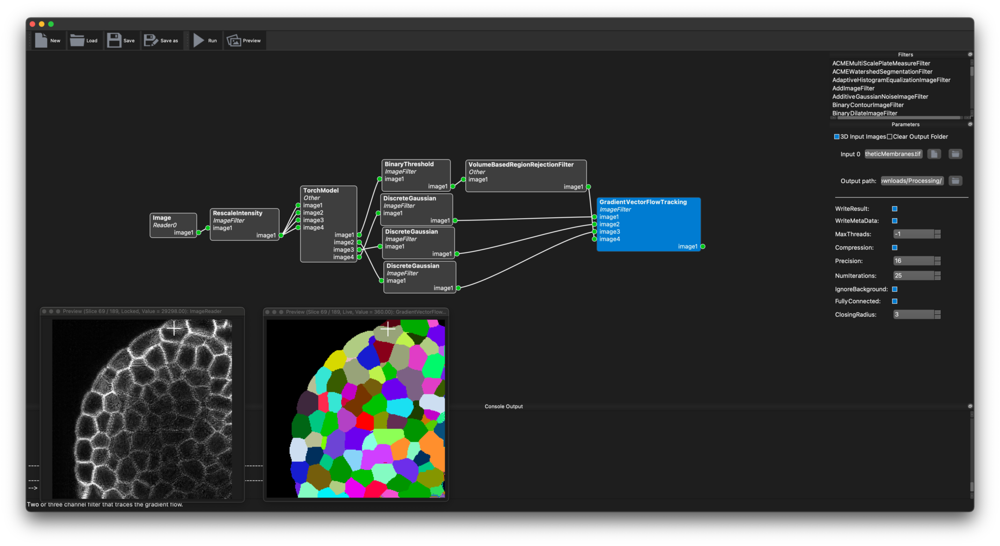
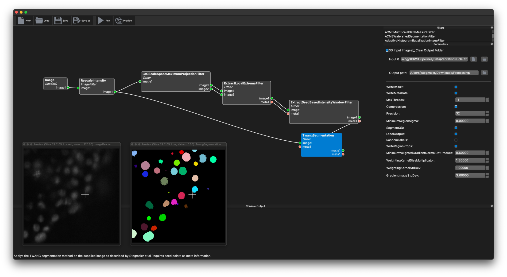

# XPIWITPipelines
This repository contains a selection of pipelines for XPIWIT, an ITK-based graphical user interface that allows you to assemble image processing pipelines in a drag&drop style. The latest binaries of XPIWIT for all major platforms (Windows, Linux, macOS) can be obtained form https://bitbucket.org/jstegmaier/xpiwit/downloads/ .

Reference: Bartschat, A., Hübner, E., Reischl, M., Mikut, R., & Stegmaier, J. (2016). XPIWIT—an XML pipeline wrapper for the Insight Toolkit. Bioinformatics, 32(2), 315-317.

# Cellpose3D

This pipeline can be used to apply our 3D implementation of the Cellpose algorithm (originaly by Stringer et al., 2021). Make sure to use one of the latest XPIWIT releases, as the filter was only recently added. 

- Input: The filter expects an input image, which can be either a 2D or a 3D image containing cellular membranes or cell nuclei (depending on which pretrained model you're using). An example image to produce a similar output as shown on the screenshot below can be found in `Data/SyntheticMembranes.tif`.
- Output: Segmented image in the subfolder `*GradientVectorFlowTracking*`.
* Parameters:
  * Filter `TorchModel`, Parameters `Patch*`: Width, height and depth used for patch-based processing. Note that the number has to be evenly divisible by 2 several times for the down-sampling path used for the Unet model. The patch stride controls the overlap between patches and avoids artifacs at patch boundaries if large enough.
  * Filter `TorchModel`, Parameter `ModelPath`: Absolute path to the model to use for prediction. This should be a `*.pt` file containing a pretrained model suitable for the selected segmentation task. A demo model for Cellpose3D that was trained on confocal microscopy images of membrane labeled *A. thaliana* are provided next to the XPIWIT pipeline files in this repository.
  * Filter `BinaryThreshold`, Parameter `LowerThreshold`: The probability at which the background prediction should be thresholded. Values below this threshold are background and values above it are considered as foreground. Note that the remaining filters only operate on the foreground region, i.e., potentially decrease the value if you find objects disappearing. 

  * Filter `DiscreteGaussian`, Parameter `Variance`: The variance parameter can be used to smooth the predicted gradient fields. Usually, no changes required but if you find the gradient fields to be very noisy, this can improve convergence.

  * Filter `VolumeBasedRejectionFilter`, Parameters `MinimumVolume` and `MaximumVolume`: Measured in number of voxels and can be used to exclude objects that are below or above the specified thresholds. Set to `-1` to ignore the upper or lower threshold.

  * Filter `GradientVectorFlowTracking` Parameter `NumIterations`: The number of steps to be performed for tracing the gradients of each voxel to the respective sinks. As a rough estimate, use a value slightly higher than the radius of the largest expected object. 

  * Filter `GradientVectorFlowTracking` Parameter `ClosingRadius`: If sinks are ambiguous, it can happen that multiple sinks exist in close vicinity. To connect the sinks, a morphological closing can be applied. Usually, no changes are needed, but can be increased if oversegmentation happens. Note that large values can lead to very slow performance!

Reference: Eschweiler, D., Smith, R. S. & Stegmaier, J. (2021). Robust 3D Cell Segmentation: Extending the View of Cellpose. arXiv preprint arXiv:2105.00794.

# TWANG

Reference: Stegmaier, J., Otte, J. C., Kobitski, A., Bartschat, A., Garcia, A., Nienhaus, G. U., ... & Mikut, R. (2014). Fast segmentation of stained nuclei in terabyte-scale, time resolved 3D microscopy image stacks. PloS one, 9(2), e90036.
